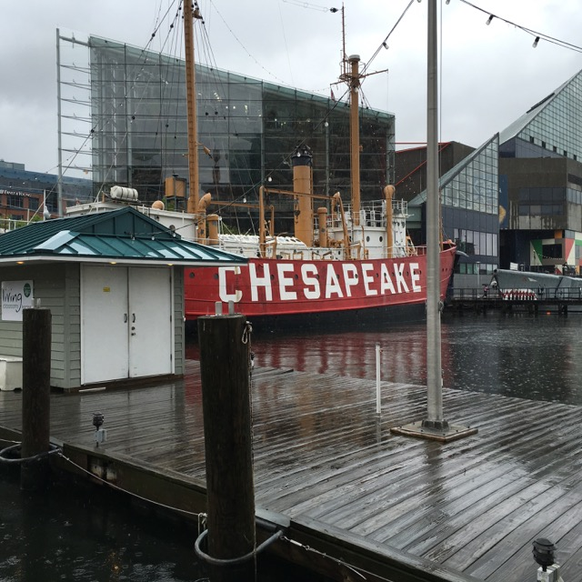
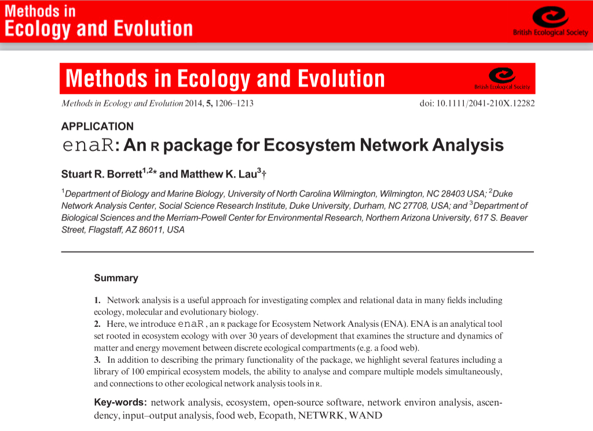

## 




## 

Chesapeake Bay (Baird 1989)

```{r , echo=FALSE}

library(enaR)
data(enaModels)
plot(enaModels[[38]])

```

## Extant Software

> - ENA.m 
> - EwE (Ecosim with Ecopath)
> - EcoNet
> - WAND 
> - Network 
> - limSolve

## 



## enaR: package architecture

> - Uses <tt>network</tt> data class
> - Model I/O ("read", "write", "pack", "unpack")
> - Ecosystem network models included
> - Balancing
> - <tt>enaR*</tt> algorithms (enaFlow, enaStructure,...)
> - Orientation functions
> - Background functions

## Getting Started

> 0. Question and Model
> 1. Input model(s) or use database
> 2. Check quality and assumptions (balance?)
> 3. Visualize
> 4. Analyze
> 5. Visualize with statistics

# enaR: Ecosystem Network Models

M = {F, z, e, r, X, Living}

## M = {F, z, e, r, X, Living}

**Model Components**

- Nodes
- Flows (connections + weights)
- Inputs
- Outputs (export and respiration)
- Storage
- Node state (living?)

## Network Data Class

```{r , echo=FALSE}

data(oyster)
oyster

```

## Balancing ~ Inputs == Outputs


## Balancing ~ (Inputs == Outputs) == "steady state"

```{r }

data(oyster)
class(oyster)
oyster <- balance(oyster)

```

## Visualize-Analyze-Visualize

```{r , eval=FALSE}

plot(oyster)
oyster.flow <- enaFlow(oyster)
throughflow <- oyster.flow$T
plot(oyster,vertex.cex=throughflow)

```
